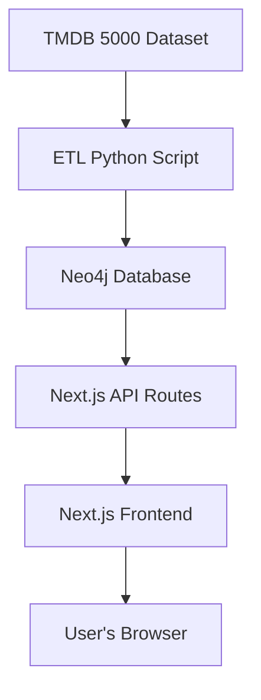
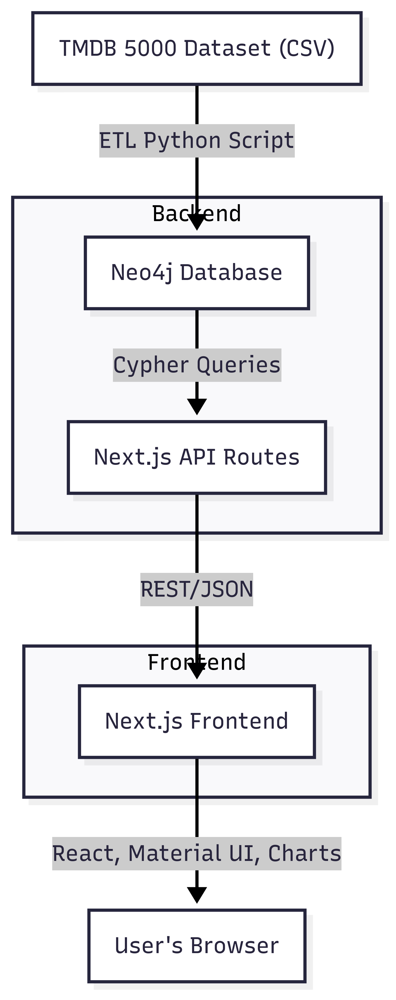

# Movie Knowledge Graph Dashboard  
**Solution & Architecture Document**

---

## 1. Overview

This project is a modern, interactive dashboard for exploring movie data using a knowledge graph approach. It leverages Neo4j for graph storage, Next.js for the frontend and backend API, Material UI for design, and modern charting libraries for data visualization.

---

## 2. Tech Stack

- **Frontend:** Next.js (React), Material UI, ApexCharts, Recharts, react-force-graph
- **Backend/API:** Next.js API routes (Node.js), Neo4j JavaScript driver
- **Database:** Neo4j (Community or Desktop)
- **ETL:** Python script to load TMDB 5000 dataset into Neo4j

---

## 3. Architecture Diagram

**Visual Diagram:**

> Place the image file (architecture-diagram.png) in your project root or a docs/ folder for correct rendering.

---

## 4. Data Flow

1. **ETL:**  
   - Python script reads TMDB 5000 dataset (movies, actors, genres, keywords, directors).
   - Loads data into Neo4j, creating nodes and relationships.

2. **Backend/API:**  
   - Next.js API routes connect to Neo4j using the official driver.
   - Endpoints for overview, genres, keywords, popularity/revenue, vote/budget, graph data, search, recommendations, etc.

3. **Frontend:**  
   - Next.js pages fetch data from API routes.
   - Material UI for layout and components.
   - ApexCharts/Recharts for charts, react-force-graph for graph visualization.
   - Vuexy-inspired UI: sidebar, topbar, KPI cards, modern charts, force-directed graph explorer.

---

## 5. Key Components

- **Sidebar & Topbar:** Navigation and branding.
- **KPI Cards:** Quick stats (movies, actors, genres, directors).
- **Charts:** Genre pie, keyword bar, popularity vs revenue scatter, budget line, vote histogram.
- **Graph Explorer:** Interactive force-directed graph of movies, actors, genres, etc.
- **Pages:** Dashboard, Movies, Actors, Genres, Keywords, Graph Explorer, Search, Profile, Watchlist.
- **API Endpoints:** `/api/overview`, `/api/genres`, `/api/keywords`, `/api/popularity-revenue`, `/api/vote-budget`, `/api/graph`, `/api/search`, `/api/recommendations`, etc.

---

## 6. Design Decisions

- **Next.js:** Enables SSR, API routes, and easy deployment.
- **Material UI:** Professional, modern, and responsive UI.
- **Neo4j:** Flexible graph queries for complex relationships.
- **ApexCharts/Recharts:** Modern, interactive charts.
- **Component-based structure:** Easy to maintain and extend.

---

## 7. Setup & Deployment

- **Clone the repo**
- **Install dependencies:**  
  - Python: `pip install -r etl/requirements.txt`
  - Node.js: `cd frontend && npm install`
- **Start Neo4j** (Desktop or Community)
- **Run ETL:** `python etl/etl_to_neo4j.py`
- **Start frontend:** `cd frontend && npm run dev`
- **Access app:** [http://localhost:3000](http://localhost:3000)

---

## 8. Security & Best Practices

- API credentials are stored securely (use environment variables in production).
- Defensive programming in API and frontend to handle errors and empty data.
- Modern UI/UX for accessibility and usability.

---

## 9. Extensibility

- Add new analytics or visualizations by creating new API endpoints and frontend components.
- Easily extend graph schema in Neo4j for more relationships or properties.

---

## 10. Contact & Support

For questions or support, contact the project maintainer.

--- 